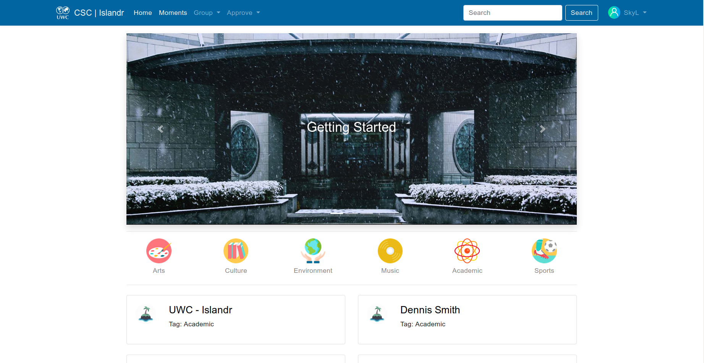

### Islandr is a website for UWCCSCer to organize, publicize and find interesting activities
***

<div align=center></div>

## Content
- [Content](#content)
- [Getting_Started](#gettingstarted)
  - [Prerequisites](#prerequisites)
  - [Installing](#installing)
- [Unit Test](#unit-test)
- [Fake Users and Posts](#fake-users-and-posts)
- [Contributing](#contributing)
  - [Pull Request Process](#pull-request-process)

***
## Getting_Started
### Prerequisites
* Python 3.6.x (3.7.x is not supported)
  * If you haven't installed anaconda on your computer, here is the URL link to [Download Anaconda](https://www.anaconda.com/download)
* Virtualenv
* Mac OS or Linux
```
$ sudo apt-get install python3-venv
```
### Installing
1. Click the top-right `Fork` button and fork my repo to your own repo
2. Clone your repo to your local computer
```
$ git clone https://github.com/<your_username>/Islandr.git
$ cd Islandr
```
3. Create Virtualenv
```
$ python3 -m venv venv
```
4. Add FLASK_APP to your activate shell file
```
$ vim venv/bin/activate
```
<p style="text-indent:2em;">Add this line at the buttom of activate file</p>

```shell
export FLASK_APP=flasky.py
```
<p style="text-indent:2em;">Save and exit the file by pressing `Contrl+C` and `:wq`</p>  

5. Activate Virtualevn
```
(venv)$ source venv/bin/activate
```
6. Generate your database
```
(venv)$ flask db init
(venv)$ flask db migrate -m "first migration"
(venv)$ flask db upgrade
```
7. Run your flask app
```
(venv)$ flask run
```
8. Go to http://127.0.0.1:5000/ and see the app running

***
## Unit Test
```
(venv)$ flask test
```
Expecting Output
```
test_app_exists (test_basics.BasicsTestCase) ... ok
test_app_is_testing (test_basics.BasicsTestCase) ... ok
test_no_password_getter (test_user_model.UserModelTestCase) ... ok
test_password_salts_are_random (test_user_model.UserModelTestCase) ... ok
test_password_setter (test_user_model.UserModelTestCase) ... ok
test_password_verification (test_user_model.UserModelTestCase) ... ok
test_user_role (test_user_model.UserModelTestCase) ... ok

-----------------------------------------------------------------
Ran 7 tests in 0.244s

OK
```

***
## Fake Users and Posts
```
(venv)$ flask shell
```
```python
from app import faker
faker.users()
faker.posts()
```
100 users and posts will be added into your database

***
## Contributing
When contributing to this repository, please first discuss the change you wish to make via issue, email, or any other method with the owners of this repository before making a change.
### Pull Request Process
<div align=center></div>

****

|Author|zlxlty|
|---|---|
|E-mail|skylty01@gmail.com|


****
